# 🎒 COMPONENTES

Explora mazmorras, desarrolla a tu héroe y visita la aldea con los componentes que se muestran a continuación. Cada apartado presenta un componente y explica su función en el juego.

---

## 🏘️ TABLERO DE LA ALDEA

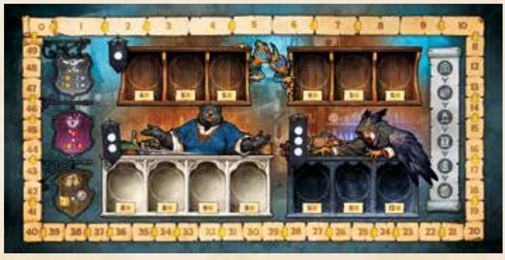

**Cantidad: 1.**

Este tablero compartido contiene las tiendas de la aldea y el marcador de puntos de valor (PV). Los jugadores visitan la aldea para comprar fichas, conseguir herramientas y recuperar salud.

---

## 🧙 TABLEROS DE HÉROE

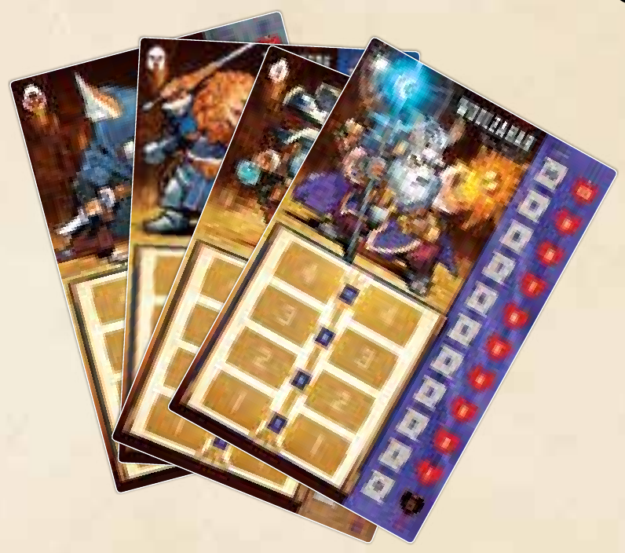

**Cantidad: 4.**

Cada jugador utiliza el tablero de su héroe. En él aparecen los marcadores de salud y experiencia (XP), los espacios del árbol de habilidades y los costes de XP para subir de nivel.

---

## 📖 HOJAS DE REFERENCIA DE HABILIDADES / REFERENCIA RÁPIDA

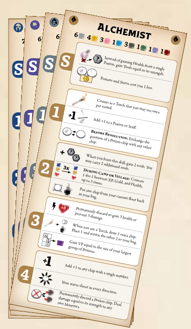

**Cantidad: 4.**

Estas hojas explican las habilidades de cada héroe. En el reverso incluyen una referencia rápida de los pasos de la fase de resolución.

---

## ✨ FICHAS DE HABILIDADES INICIALES

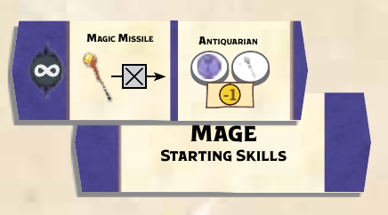

**Cantidad: 4.**

Cada héroe comienza con una ficha de habilidades iniciales. Esta muestra las dos habilidades que tiene disponibles al principio de la partida.

---

## 🌟 FICHAS DE HABILIDADES DE SUBIDA DE NIVEL

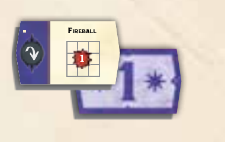

**Cantidad: 48.**

Estas fichas representan las habilidades adicionales que pueden desbloquear los héroes. Durante la fase de campamento, los jugadores gastan XP para subir de nivel y elegir una habilidad del siguiente nivel de su árbol de habilidades.

---

## 🚪 MAPAS DE ENTRADA A LA MAZMORRA

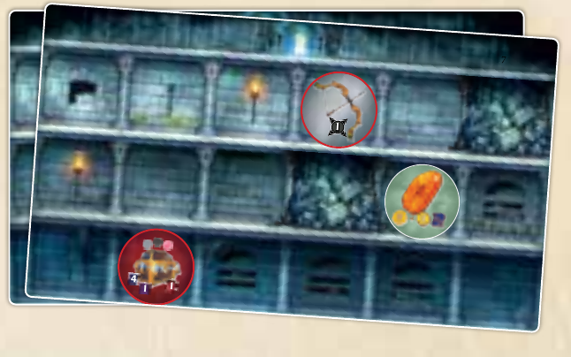

**Cantidad: 12.**

Estos mapas de doble cara suelen formar el inicio de cada mazmorra. Cada mapa de entrada tiene tres pisos, con casillas, elementos y obstáculos que afectan a la colocación de las fichas.

---

## 🕳️ MAPAS DE PROFUNDIDADES DE LA MAZMORRA

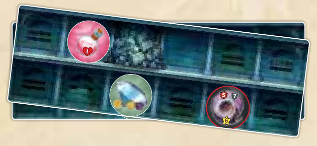

**Cantidad: 12.**

Estos mapas de doble cara añaden dos pisos más a la mazmorra. Cuando un mapa está completo y quedan fichas en el zurrón, se coloca un mapa de profundidades debajo para continuar explorando.

---

## 🧝 FIGURAS DE HÉROE

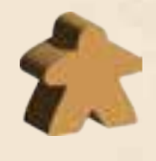

**Cantidad: 4.**

Coloca la figura de tu héroe junto a la mazmorra para indicar en qué piso te encuentras. Muévela hacia abajo a medida que desciendas, para saber dónde puedes colocar tu siguiente ficha.

---

## ❤️ MARCADORES DE SALUD

**Cantidad: 4.**

Estos marcadores indican la salud actual de cada héroe en su tablero. Ajusta el marcador cada vez que el héroe reciba daño o recupere salud.

---

## ⭐ MARCADOR DE EXPERIENCIA (XP)

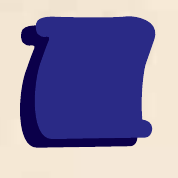

El marcador de XP registra la experiencia acumulada por el héroe. Los jugadores pueden gastar XP durante la fase de campamento para subir de nivel y desbloquear habilidades adicionales.

---

## 🏆 FICHA DE PUNTOS DE VALOR (PV)

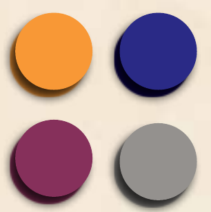

Esta ficha registra los puntos de valor en el tablero de la aldea. El jugador que tenga más PV después del recuento final gana la partida.

---

## 🪙 FICHAS INICIALES

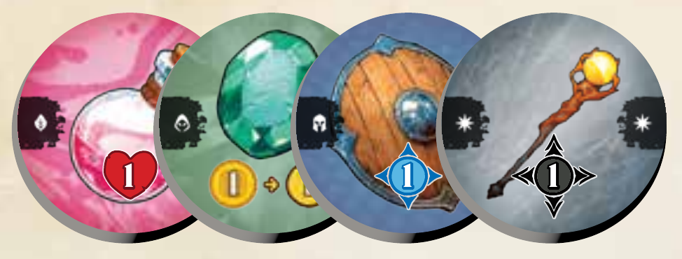

**Cantidad: 40.**

Cada héroe dispone de un conjunto de 10 fichas iniciales identificadas con su símbolo. Durante la preparación se introducen en el zurrón correspondiente y forman su colección inicial de fichas.

---

## 🃏 CARTAS DE CAMINO

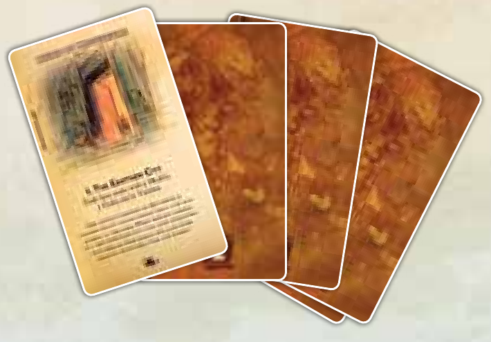

**Cantidad: 21.**

En cada partida se utiliza un camino de cinco cartas. La primera indica los recursos iniciales, mientras que las siguientes introducen instrucciones, reglas especiales u objetivos a medida que avanza la aventura.

---

## 🚩 FICHA DE JUGADOR INICIAL

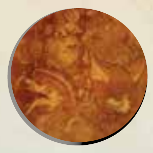

**Cantidad: 1.**

Esta ficha identifica al jugador inicial. Durante la fase de aldea, ese jugador realiza el primer turno y los demás continúan en el sentido de las agujas del reloj.

---

## 🔹 FICHAS DE NIVEL 1

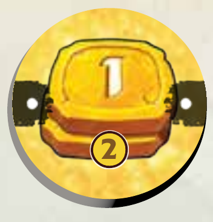

**Cantidad: 30.**

Estas fichas se identifican con un punto y están disponibles en las tiendas de nivel 1. Las fichas compradas se añaden al zurrón para futuras expediciones a la mazmorra.

---

## 🔷 FICHAS DE NIVEL 2

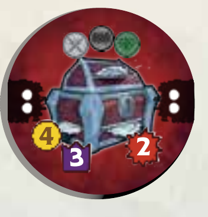

**Cantidad: 20.**

Estas fichas se identifican con dos puntos y están disponibles en la tienda de nivel 2. Cómpralas con oro durante la fase de aldea para añadir más opciones a tu zurrón.

---

## 💎 FICHAS DE NIVEL 3

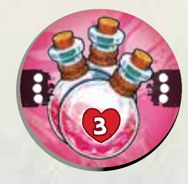

**Cantidad: 15.**

Estas fichas se identifican con tres puntos y están disponibles en la tienda de nivel 3. Esta tienda comienza cerrada y abre en la segunda ronda.

---

## 💰 FICHAS DE ORO

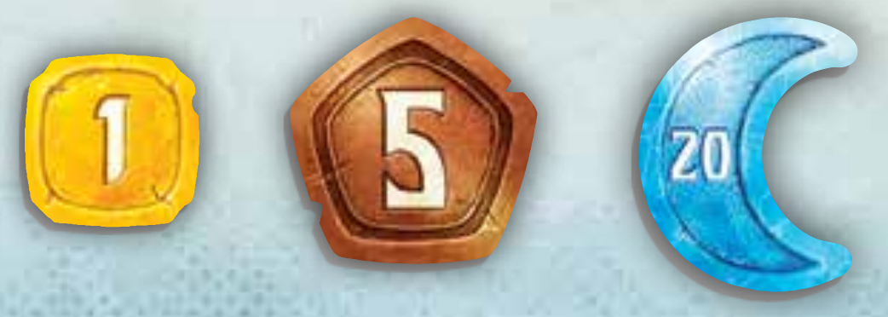

Las fichas de oro representan el dinero conseguido durante la aventura. Puedes gastar oro en la aldea para comprar fichas y herramientas o pagar por curación adicional.

---

## 🎒 ZURRONES

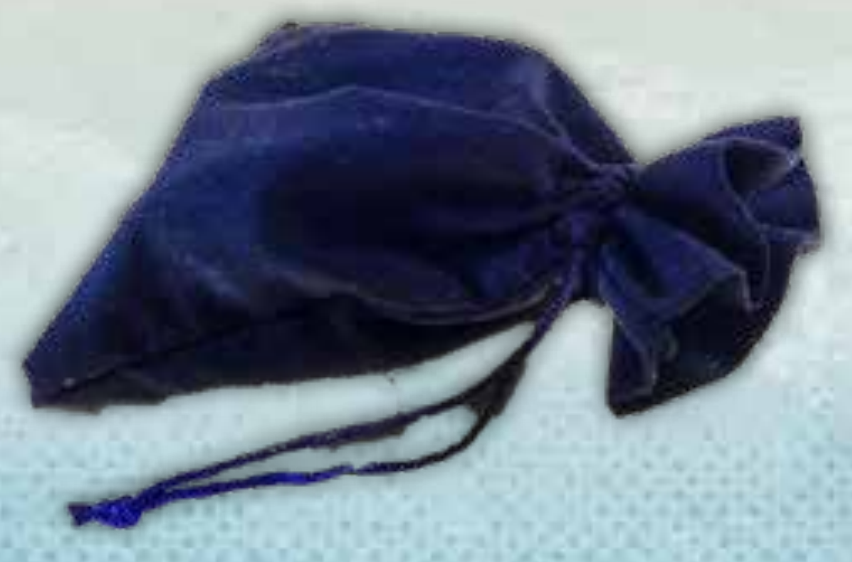

**Cantidad: 4.**

Cada jugador tiene un zurrón del color de su héroe. En él guarda sus fichas, que se sacan de una en una durante la fase de mazmorra y se colocan en el mapa.

---

## 🛠️ HERRAMIENTAS

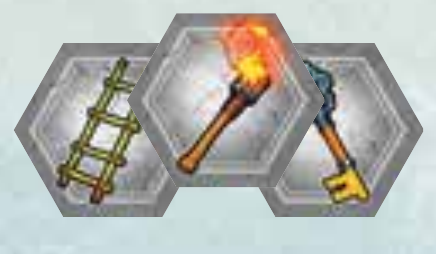

**Cantidad: 45.**

Las herramientas son objetos de un solo uso que se descartan después de utilizarlos. Las antorchas ayudan al sacar fichas, las escaleras permiten pasar al siguiente piso y las llaves cumplen uno de los requisitos de un cofre.

